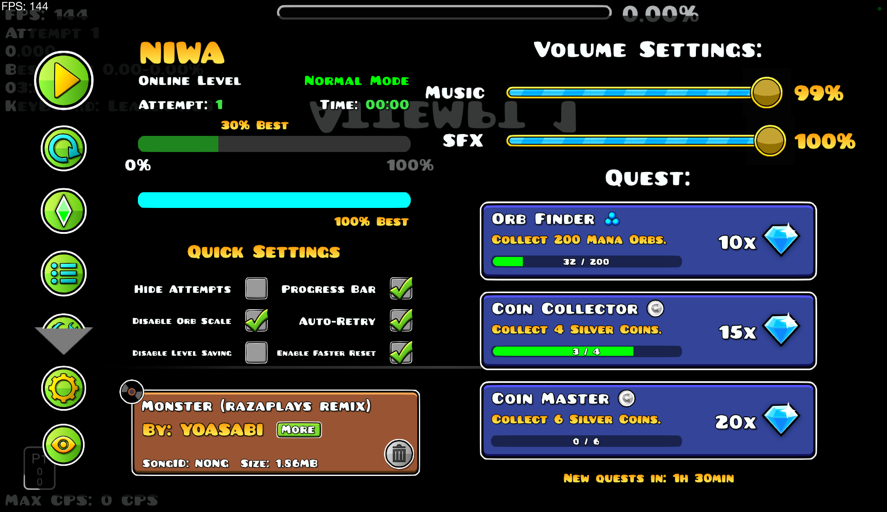
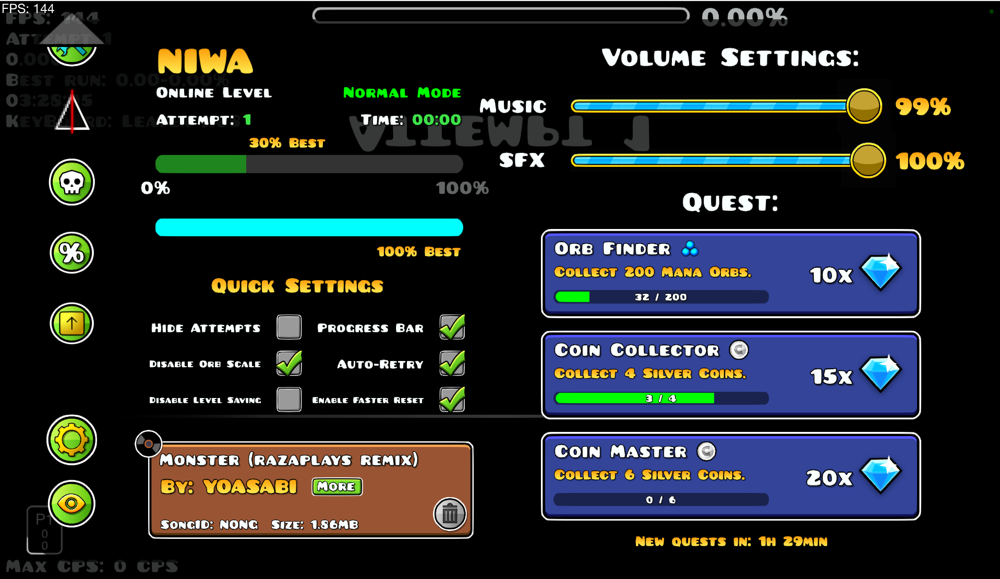
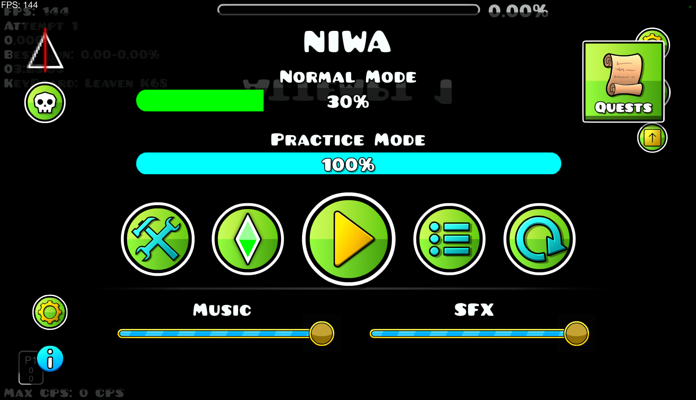
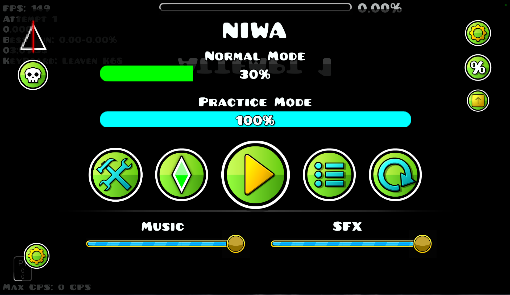
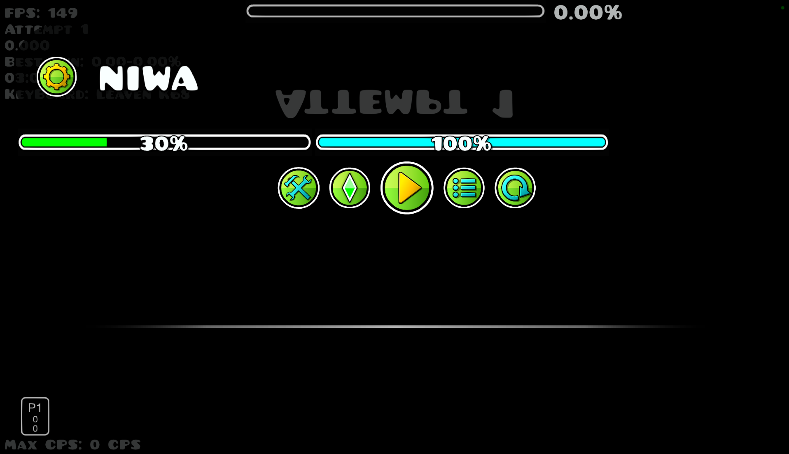

# BetterPauseP

An unofficial Windows x64 maintenance port of BetterPause for Geometry Dash 2.2081 and Geode 5.9.0.

## Features

- Expanded pause-menu level information and progress details.
- Quick settings, volume controls, and shortcuts to useful menus.
- A scrollable pause-button column that supports buttons added by other mods.
- A texture-pack-aware control for hiding and restoring the pause menu.
- Compatibility fixes for third-party pause buttons, including Death Tracker and Inputs Viewer.

## Screenshots

### BetterPause menu

### Support all mod buttons

### With lots of Pause Mode!

- AG.Pause:

- Normal Pause:

- Simple Pause:

## Requirements

- Geometry Dash 2.2081 with Geode 5.9.0 or newer
- `geode.node-ids` 1.23.3 or newer
#### * !Note: For now, I've only created a port for Windows; if I have time, I might port it to mobile as well!

## Credits

BetterPause was created by [TpdeaX](https://github.com/TpdeaX). This port is based on the [original BetterPause project](https://github.com/TpdeaX/BetterPause) and its [older Geode port](https://github.com/TpdeaX/BetterPause-Geode).

This repository is an unofficial maintenance port and does not claim ownership of the original project.

## Reporting issues

Use [GitHub Issues](https://github.com/HunggKirito/BetterPauseP/issues) or contact `hungqnvn` on Discord.
